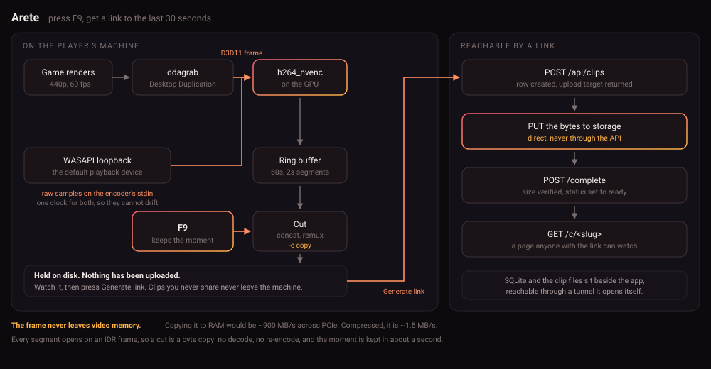

# Arete

Press F9, get a link to the last 30 seconds of your game.

A Windows gameplay clipper. Recording happens on the GPU, so frames never get
copied into system RAM, and nothing uploads until you decide a clip is worth
keeping.

One .exe. It records, stores the clips, serves the share pages, and opens its
own tunnel so links work outside your machine. Nothing else to install and no
account to sign up for.

**[Download Arete.exe](https://github.com/teorii/arete-clips/releases/latest)**

## Demo

https://github.com/user-attachments/assets/889149db-ca56-4dfe-af04-ae8a598359c5

90 seconds with sound: clipping mid-game, previewing before sharing, generating
a link, pasting it into Discord, opening the share page. Names and unrelated
windows are blurred.

Full resolution version is
[on the release](https://github.com/teorii/arete-clips/releases/download/v1.0.0/arete-demo.mp4).

## How it works



`ddagrab` hands D3D11 frames straight to `h264_nvenc`. At 1440p60, pulling those
frames into system RAM would be around 900 MB/s over PCIe. Encoded, it's about
1.5 MB/s. That gap is the difference between something you can leave running
during a match and something you can't.

Clips are cut with `-c copy`. Every segment in the ring buffer starts on an IDR
frame, so trimming to a segment boundary is just concatenating bytes. No decode,
no re-encode.

Audio comes from whatever device Windows is playing to, and follows it if you
switch. ffmpeg can't open a WASAPI device, so the samples get read in Python and
piped into the encoder's stdin. The same process timestamps video and audio,
which is the whole point of the pipe: record them separately and you have two
clocks to reconcile, and every clip ends up with its audio running early.

## Measured

RTX 3070, 2560x1440 at 60 fps, 12 Mbps:

| | |
|---|---|
| Cut (snapshot, concat, remux, poster frame, sha256) | 1.09 s |
| Hotkey to clip on disk | 1.10 s |

16 second clip, 23.2 MB, video and audio both 16.000 s.

Upload isn't in there. Clips stay local until you ask for a link, and at that
point it's your uplink that matters rather than anything here. The cut time is
mostly moving ~50 MB of segments around and hashing the result, not the remux.

## Running it

Needs Windows, an NVIDIA GPU with NVENC, and Python 3.12 to run from source.
ffmpeg and cloudflared are bundled into the packaged build.

```
pip install -r requirements.txt
cd frontend && npm install && npm run build
python desktop.py
```

Flags: `--verbose` for access logs and devtools, `--no-capture` to skip
recording, `--no-tray` so closing the window quits.

| Part | Command |
|---|---|
| Desktop app | `python desktop.py` |
| API and share pages | `python -m uvicorn server.main:app --port 8000` |
| Capture daemon | `python -m capture.daemon` (`--test` clips once, `--probe` lists displays) |
| Frontend, dev | `cd frontend && npm run dev` |
| Tests | `python -m pytest` |

Build the exe with `python -m PyInstaller --clean --noconfirm arete.spec`.

## Setup

Three questions on first run:

- **Where clips live.** This PC by default: a SQLite file and a folder in
  `%APPDATA%\Arete`, nothing to install. Or point it at someone else's Arete
  with their address and an invite code.
- **What to record.** A display, numbered the way Windows numbers them.
- **How much.** Clip length and the hotkey.

There's no key to get hold of. A hosting install makes its own account on first
start and prints an address and invite code for adding another machine.

## Settings

In the library header, or from the tray icon.

- **Recording.** Source, clip length, hotkey, quality, and an audio timing
  offset if your hardware needs one. Saving restarts the capture.
- **Behaviour.** Capture sound, notifications, whether X quits or minimises to
  the tray, clipboard, delete confirmation, storage warnings.
- **This install.** Where clips live, which audio device, the folder, and the
  address and invite another machine needs.

`config.env` holds what the app needs to start. `preferences.json` holds how it
behaves, read fresh each time so a change applies immediately.

## Capture and publish are separate

The hotkey saves the moment. It doesn't upload anything.

Held clips are files on your machine and the server doesn't know they exist. The
library marks them **No link yet** and plays them locally so you can decide.
Nothing uploads until you hit **Generate link**. Clips you don't share never
leave the machine.

## Sharing

The app opens a Cloudflare quick tunnel on start and closes it on quit. Set
`MANAGE_TUNNEL=false` to skip it, and links then only work locally.

Quick tunnels get a **new hostname every launch**, so yesterday's links are
dead. Worth knowing before you send someone a link you want to last. Fixing it
properly means a named tunnel on your own domain, which is a Cloudflare account
rather than code.

Clip files come off the same host as the page, so one link covers both. Anyone
with the link can watch. Listing the library needs a key.

## Identity

Clients send an API key in `X-API-Key` and only the hash is stored. `owner_id`
comes from the key and every library query filters on it, so libraries are
separate by default.

Public: `/c/<slug>`, the rendition files, `/healthz`. Everything else needs a
key. Touching someone else's clip returns 404 rather than 403, since a 403 tells
you the clip is there.

## Layout

| Path | What it is |
|---|---|
| `desktop.py` | The app: API, capture, tray and window in one process |
| `branding.py` | Name, colours and mark. One source for every surface |
| `capture/` | `ringbuffer.py` -> `cutter.py` -> `uploader.py`, plus `loopback.py` for sound |
| `server/` | FastAPI. `main.py` routes, `models.py` schema, `storage.py` backends |
| `frontend/` | React and Vite clip library, served at `/app` |
| `ui/` | First-run setup and settings, plain HTML in the app window |
| `tools/` | Icon and launcher builders, user administration |
| `docs/design/` | The system design this implements |

## Tests

`python -m pytest` runs 139 of them: clip lifecycle, upload signature
enforcement, ring buffer segment selection, the settings bridge, single
instance, child process cleanup, the audio pipe.

Capture itself isn't covered. It needs a GPU and a real display.

## Scale

Built for one person, deliberately. Dedup, storage tiering, retention policies,
event pipelines, multi-region: none of it solves a problem this has.

[What would change at 20M MAU](docs/scaling.md) works through the version that
does.
